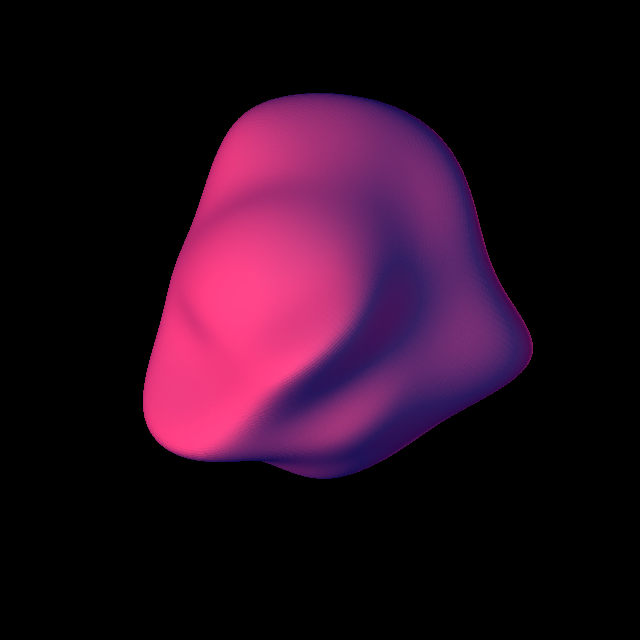
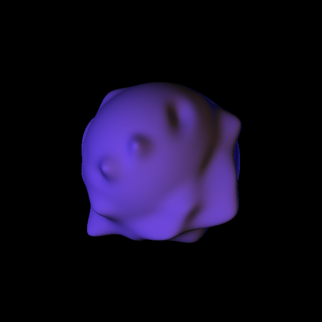
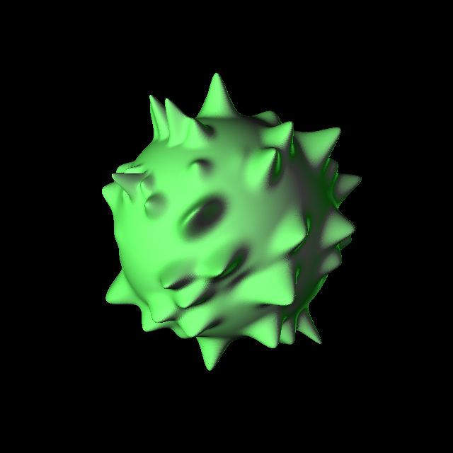

B-fun
=====

B-Splines are a type of parametric curves and surfaces.

This program is one I wrote to toy around with evaluating B-Splines on the
GPU. It requires quite recent hardware and drivers, as it uses tessellation
shaders to achieve it.

You can tune most of the parameters in `parameters.h`. Here are some screenshots
of outputs that I got.

